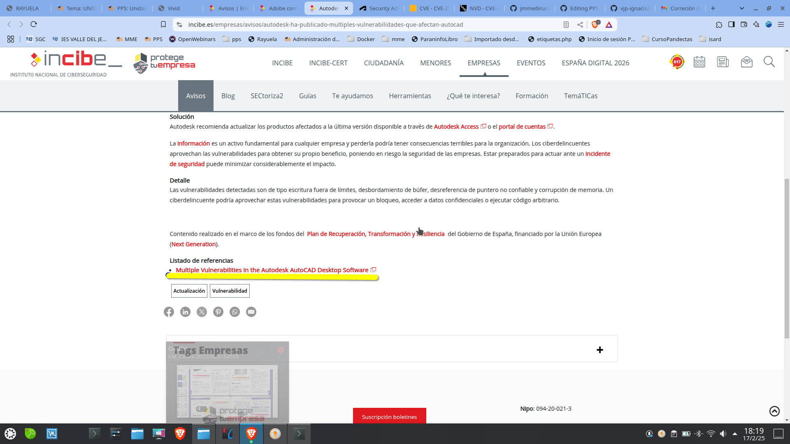
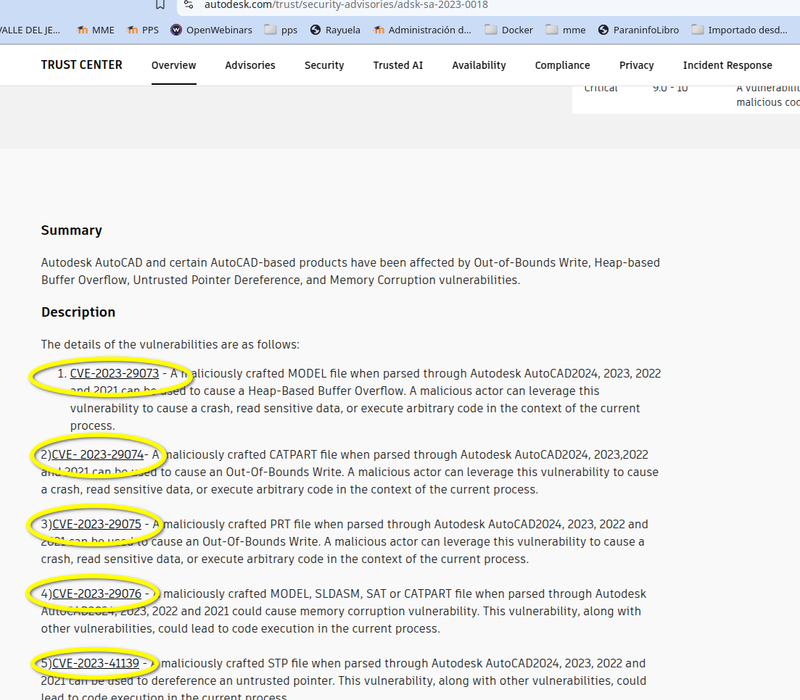
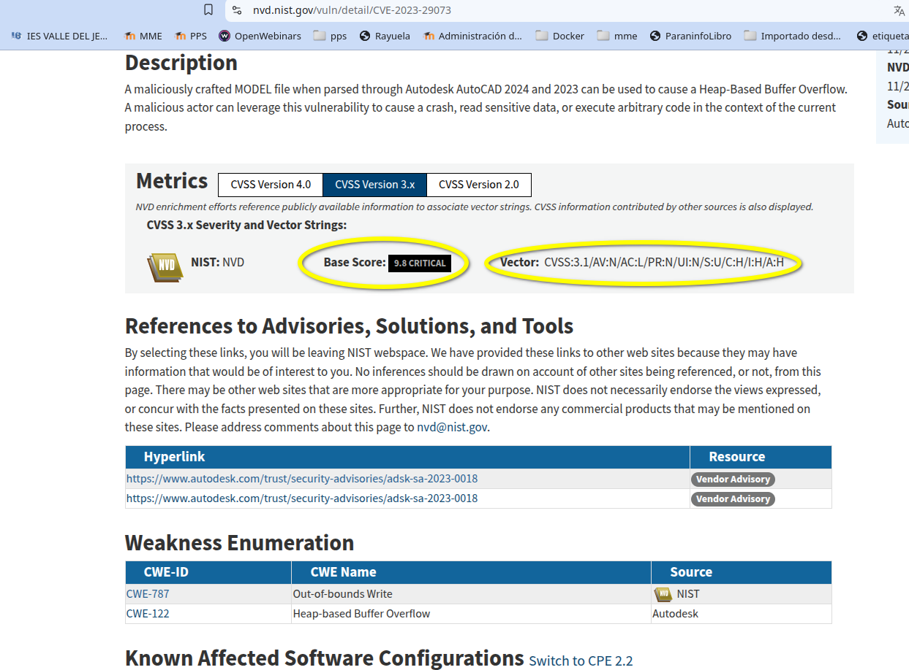

# PPS-Unidad2Actividad1-JoseMi 
#Trazado de una vulnerabilidad.
Actividad 1 de la Unidad 1 de Puesta en Producción Segura. Tabajaremos con los Entornos de Desarrollo

Tenemos varios objetivos:

> [Conocer las diferentes listas que tienen que ver con amenazas de seguridad](#Listas)

> [Obtener información de una vulnerabilidad navegando por las webs de los organismos que mantienen esas listas.](#Trazado)

---
## Listas

En [este enlace](https://moodle.educarex.es/ccff_iesvjp/pluginfile.php/27882/mod_resource/content/17/PresentacionUnidad2NivelesSeguridadAplicaciones2025.pdf) puedes ver la presentación donde se pueden encontrar información sobre las organizaciónes y agencias que mantienen información sobre amenazas, vulnerabilidades, debilidades etc.

## Trazado
Vamos a seguir el trazado de una vulnerabilidad a partir del [este artículo del INCIBE](https://www.incibe.es/empresas/avisos/autodesk-ha-publicado-multiples-vulnerabilidades-que-afectan-autocad).

Como vemos nos informan de varias vulnerabilidades presentes en la aplicación AutoCad, desarrollado por Autodesk.

Como en este artículo no nos dán información sobre el número de la vulnerabilidad, nos vamos al apartado de referencias, donde nos indican una referencia del desarrollador:

Dándole al enlace nos lleva a la página: [https://www.autodesk.com/trust/security-advisories/adsk-sa-2023-0018](https://www.autodesk.com/trust/security-advisories/adsk-sa-2023-0018)

## Información sobre Vulnerabilidades
Allí vemos una descripción de los problemas y cómo son varias las vulnerabilidades detectadas:

Además el desarrollador, nos informa de los productos y versiones afectadas y desde dónde nos podemos descargar los parches de seguridad o software con las vulneravilidades ya corregidas.

Vamos a proceder con el trazado de la primera vulnerabilidad presente, en nuestro caso la__CVE-2023-29073__.

Para ver información sobre dicha vulnerabilidad podemos acudir al menos a dos fuentes:

- [La sección de CVE que mantiene mitre.org](https://cve.mitre.org)

- [La base de datos de vulnerabilidades de la NVD](https://nvd.nist.gov/vuln/detail/CVE-2023-29073)

## Información sobre el riesgo o criticidadde una vulnerabilidad

Desde la [entrada correspondiente a la vulnerabilidad en la NVD](https://nvd.nist.gov/vuln/detail/CVE-2023-29073) podemos ver lo primero la información de la criticidad que la vulnerabilidad presenta, así como información así como el vector asociado a dicho nivel en la CVSS. En este caso vemos que tiene una valoración de 9.8.
 
 

Si ponemos el cursor sobre el Vector nos aparecerán los valores correspondientes a las diferentes métricas que se han usado para calcularlo.

---
## ENTREGA
>__Crea un repositorio  con nombre PPS-Unidad1Actividad1-Tu nombre que contenga las respuestas a las preguntas y las evidencias de que has realizado las operaciones indicadas.__

>__Sube a la plataforma, tanto el repositorio comprimido como la dirección a tu repositorio de Github.__
